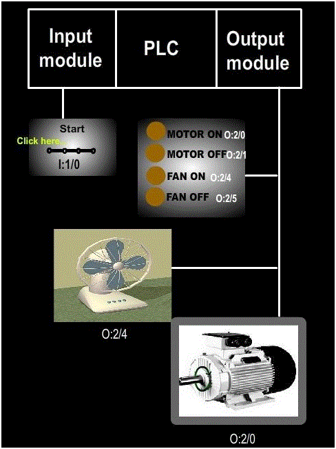
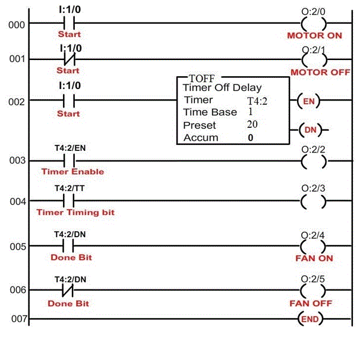
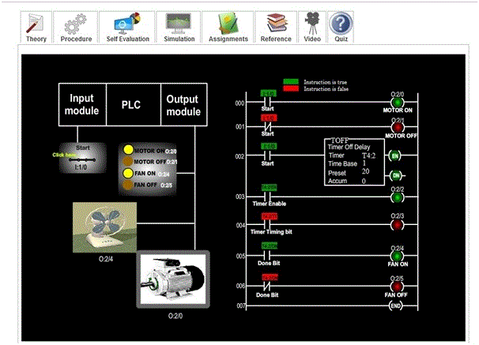
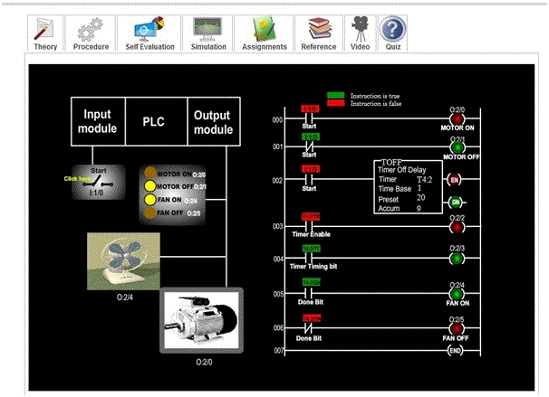
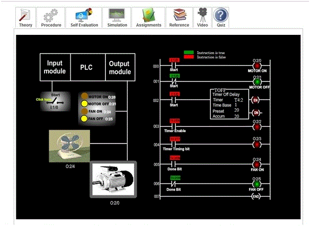

### Aim of the experiment: PLC Off-Delay Timer Instruction

<b>Aim</b>: To understand the working of Off-Delay Timer instruction in a Programmable Logic Controller.

### Procedure :

In our experiment we wish to demonstrate the working of Off-Delay Timer instruction. 

<ul type=disc style="text-align: justify;">
<li>Since the inputs and outputs are less, 8-point input module and 8 point output module is sufficient, where CPU resides in slot 0, input module resides in slot 1 and output module in slot 2. </li>

<li>In our experiment, an external cooling fan on a motor is used, which has to run all the time when the motor is running and also for 20-seconds after the motor is turned off. For this purpose, we use 20-second off-delay timer. The 20 second timing cycle begins when the motor is turned off. Here, a switch is used to turn the motor ON or OFF. The working status of the motor is displayed using LED’s. When the motor is running, MOTOR ON LED will glow. When the motor is not running, MOTOR OFF LED will glow. The working status of the external cooling fan is displayed using another 2 LED’s. when the fan is running, FAN ON LED will glow. </li>

<li> Let us assigns address for the input and output signals of the PLC:  
&nbsp;&#10147; Start (switch) : I:1/0   
&nbsp;&#10147; Motor, MOTOR ON (LED) : O:2/0  
&nbsp;&#10147; MOTOR OFF (LED): O:2/1   
&nbsp;&#10147; FAN ON (LED) : O:2/4  
&nbsp;&#10147; FAN OFF (LED) : O:2/5</li>

<li>Let us see the ladder diagram: 

</li>

<li>In order to see how the off-delay timer instruction in a PLC works, click (toggle) the start switch and observe the timer instruction. Also, observe the LED’s, motor and external cooling fan correspondingly.   

</li>
The following screen shot explains the operations: 

 

The above screen shot represents the default condition i.e. when the switch is closed. 

 
The above screen shot represents the condition when the switch is open and the timer is timing. 

 
The above screen shot represents the condition when the timer is done timing and the motor is off. 
